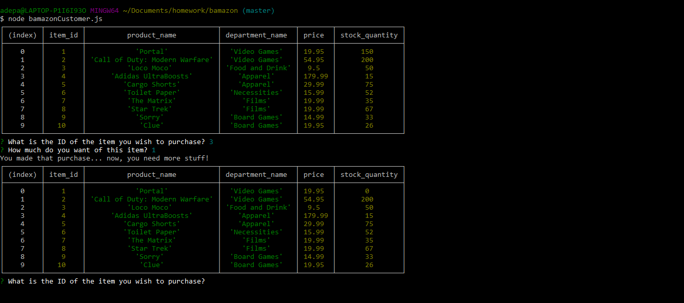

# bamazon_store (customer version)
Node application to emulate a fake e-commerce store.

## Get Started
clone repo
use schema.sql to create your database
npm install mysql & inquirer
use prefereed terminal to run js file.

### How to use the application

#### node bamazonCustomer.js
- When you run this js file you will be shown all of the items avaliable

- You will be then asked what item you would like to purchase from the list, by ID#

- You will select the item by its ID #

- Then you will be asked how many you would like to buy

- Once your purchase is complete you will be shown your total and the database will update

- If the item quantity can not be fulfilled then the purchase will not go through

example: ;

Press ctrl c or command c to exit